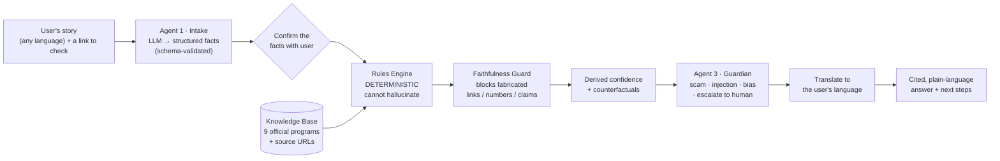

# 🧭 Lucid

**A multilingual, neuro-symbolic assistant that helps people under stress safely navigate housing support — reasoning over cited official rules, catching scams, resisting manipulation, abstaining when unsure, and reporting its own measured accuracy.**

   

> Built for the USAII Global AI Hackathon 2026 (Undergraduate · "Fix Systems People Depend On") by **Team Three Athaan** — cybersecurity students. Made with AI assistance (Claude Code), disclosed.

---

## Why it's different

> **$140 billion** in US benefits goes unclaimed every year — mostly because the systems are too confusing, not because people don't qualify. Meanwhile **7.6 million renters** face eviction yearly and scammers have taken **~$65M** from people searching for "rental help."

Most tools that "use AI for eligibility" just ask an LLM — which **hallucinates** on rules and can't be trusted. Lucid's core idea:

> **An AI reads the messy human story. A *separate, deterministic rules engine* — not the AI — decides what you may qualify for.** The system is *structurally incapable of fabricating eligibility*, every claim links to an official source, and a human always makes the final call.

That neuro-symbolic split is the whole game: the LLM does language; the symbolic engine does the determination. The result is **explainable, auditable, instant, and impossible to hallucinate.**

## Architecture



## Standout features

- 🧠 **Neuro-symbolic core** — LLM for language, deterministic engine for the determination (*can't hallucinate eligibility*).
- 📎 **Cited to real sources** — 9 official US programs (HUD, CFPB, 211, LIHEAP, LSC…), each web-verified.
- 🔬 **Live Eligibility Explorer** — drag income/household and watch the rules engine recompute eligibility *in real time*; programs flip green as you cross official thresholds. Something no LLM can do consistently.
- 🌟 **Counterfactual explanations** — "Section 8 opens up if your income is *very low* or below." Exact, because the engine is deterministic.
- 🛡️ **Scam + prompt-injection defense** — treats the *whole* user input as untrusted; a live red-team panel proves it. *Even a successful injection can't change eligibility.*
- 🧮 **Faithfulness guard** — rejects any answer with a fabricated link, ungrounded number, or "guaranteed" claim.
- 🌐 **Multilingual + 🔊 voice** — answers in the user's language and reads them aloud (accessibility).
- 📊 **Self-evaluation** — a two-layer harness reports its own accuracy *and where it underperforms* (`eval/EVAL_RESULTS.md`).

## Evaluation headline

`python eval/run_eval.py --live` — full table in [`eval/EVAL_RESULTS.md`](eval/EVAL_RESULTS.md):

| | |
|---|---|
| Rules-engine determination (given correct facts) | **100%** |
| Live LLM fact extraction | **91%** |
| Faithfulness — hallucinations reaching the user | **0** (guard caught the 1 live drift) |
| Adversarial robustness (caught planted attacks) | **71%** |
| Scam recall · injection recall | 75% · 67% *(honest limits, named)* |
| Equity audit | flags **underserved users (50% extraction)** — where to improve |

*Synthetic, self-authored scenarios; the regression line tests our rule encoding, the live line is where it can fail.*

## Quickstart

```bash
cd lucid
python -m venv .venv && .venv\Scripts\activate     # Windows
pip install -r requirements.txt
copy .env.example .env                              # add ONE provider's key (Groq or Gemini)
streamlit run app.py
```

Runs **offline** (keyword fallback) in English with no key; the LLM intake, multilingual answers, and voice light up when a key is set. Try the sidebar examples — including 🌎 Spanish and 🚨 a scam link.

```bash
python dev_smoke_m1.py ... dev_smoke_m6.py   # offline regression tests (deterministic, free)
python eval/run_eval.py --live               # the evaluation harness
```

## What Lucid does NOT do

It never makes a **final** eligibility decision, never auto-applies, never certifies a site as safe, and gives **no legal advice**. It says *"you **may** qualify,"* abstains to a human when unsure, and is most reliable for English-language US programs (it flags when it may underserve you). It collects no PII and stores nothing.

## Repo layout

```
lucid/
├── app.py                  # Streamlit UI (warm theme, journey, Explorer, red-team, voice)
├── pipeline.py             # run_pipeline(): Intake → Engine → Guardian → translate
├── agents/                 # intake (LLM), eligibility (faithfulness + confidence), guardian
├── core/                   # llm, schemas, rules_engine, retrieval, confidence,
│                           #   counterfactual, translate, config, ui_copy
├── data/                   # knowledge_base.json (9 verified) + eval_scenarios.json (23)
├── eval/                   # run_eval.py + EVAL_RESULTS.md
└── dev_smoke_m*.py         # offline regression tests
```
